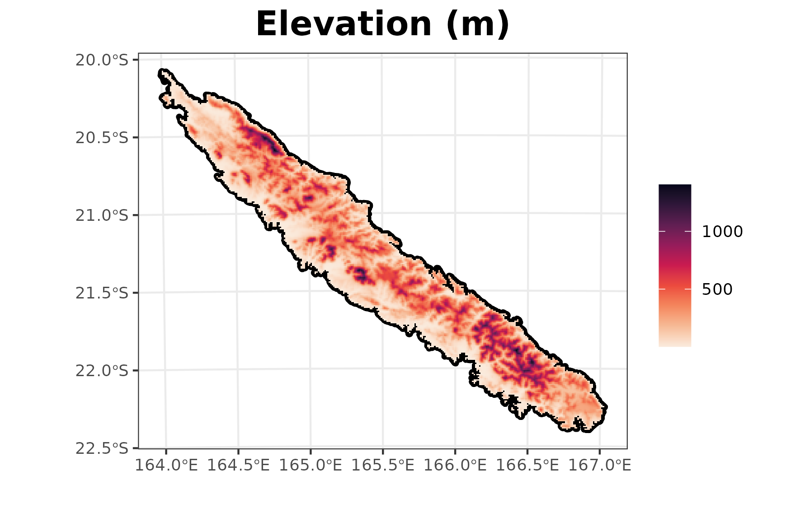

### Installation

Install the development version of **gecevar** from [GitHub](https://github.com/ghislainv/gecevar) with
`devtools::install_github("ghislainv/gecevar")`

## Import libraries

First thing to do is import **gecevar** and **terra** libraries.

```{r libraries, warning = FALSE, message = FALSE, eval = FALSE}
library(gecevar)
library(terra)
library(here)
```

## Get extent and latitude/longitude coordinates 

In this example, we take New Caledonia as example. It's an island near Australia and New Zealand. We need to begin to get the EPSG code for New Caledonia. It can be found on [epsg.io](https://epsg.io). Beware to keep the same EPSG code for all functions in the `gecevar` package. 


```{r get_extent, eval = FALSE}
name <- "New Caledonia"
epsg <- 3163
all_extent <- transform_shp_country_extent(EPSG = epsg,
                                           country_name = name,
                                           shapefile_path = NULL,
                                           extent_short = NULL)
extent <- all_extent[1]
extent_latlon <- as.numeric(all_extent[2:5])
extent
extent_latlon
```

The output is a vector of length 5. 
First element is a character with extent of New Caledonia according to EPSG:3163.
The following four elements are extent in latitude and longitude coordinates (EPSG:4326).

## Download environmental variables

One variable is protected area named WDPA in downloaded file. This variable need an identification by country name. 
Make sure that our country name is available in [www.protectedplanet.net](https://www.protectedplanet.net/en/thematic-areas/wdpa?tab=WDPA).
Otherwise leave `country_name = NULL`. 

```{r get_env_var, eval = FALSE}
environ_path <- get_env_variables(extent_latlon = extent_latlon,
                                  extent = extent,
                                  EPSG = epsg, 
                                  country_name = "New Caledonia",
                                  destination = here("vignettes",
                                                     "get_started_files"),
                                  resolution = 1000,
                                  rm_download = FALSE,
                                  gisbase = NULL)
```

We can look at the variable names in the raster.

```{r names_env_var, eval = FALSE}
r_env <- rast(environ_path)
names(r_env)
```

We can plot some data, eg. the elevation.

```{r plot_elev, eval = FALSE}
plot(r_env$elevation, range = c(0, 2000), main = "Elevation (m)",
     cex.main = 2, plg = list(cex = 1), pax = list(cex.axis = 1))
```

```{r fig_elev, echo = FALSE, out.width = 600, eval = TRUE}

```

## Download climatic variables

Climatic variables are extract from [chelsa-climate.org](https://chelsa-climate.org/). 

We get with `get_chelsa_current` function many variables.
Variables give the average value on the data recovered between 1981 and 2010.

```{r env_clim, eval = FALSE}
climate_path <- get_chelsa_current(extent = extent,
                                  EPSG = epsg,
                                  destination = here("vignettes",
                                                     "get_started_files"),
                                  resolution = 1000,
                                  rm_download = FALSE)
```

We can look at the variable names in the raster.

```{r names_clim_var, eval = FALSE}
r_clim <- rast(climate_path)
names(r_clim)
```

We can plot some data, eg. the climatic water deficit computed from the Thornthwaite equation.

```{r plot_cwd, eval = FALSE}
plot(r_clim$cwd_thornthwaite), range = c(0, 500), main = "CWD Thornthwaite (m)",
     cex.main = 2, plg = list(cex = 1), pax = list(cex.axis = 1))
```

```{r fig_cwd, echo = FALSE, out.width = 600, eval = TRUE}
knitr::include_graphics("get_started_files/figs/cwd_thornthwaite.png")
```

## Merge environmental and climatic variables

Now you can merge all our variables in one file. 

```{r merge, eval = FALSE}
merge_path <- merge_files(environ_path = environ_path,
                          climat_path = climat_path, 
                          destination = "/home/pierre/Bureau/NC")
```

Output is the absolute path to the `gecevar.tif` file which was created. 

## Download future climate

Extracted from [chelsa-climate.org](https://chelsa-climate.org/) the climate data from the five available models, namely, GFDL-ESM4, IPSL-CM6A-LR, MPI-ESM1-2-HR, MRI-ESM2-0 and UKESM1-0-LL.
Compute the average of these models for a SSP choosen. 

```{r futur, eval = FALSE}
get_chelsa_futur(extent = extent,
                 EPSG = epsg, 
                 destination = "/home/pierre/Bureau/NC",
                 resolution = 1000,
                 phase = "2071-2100",
                 ssp = 585,
                 rm_download = FALSE)
```
